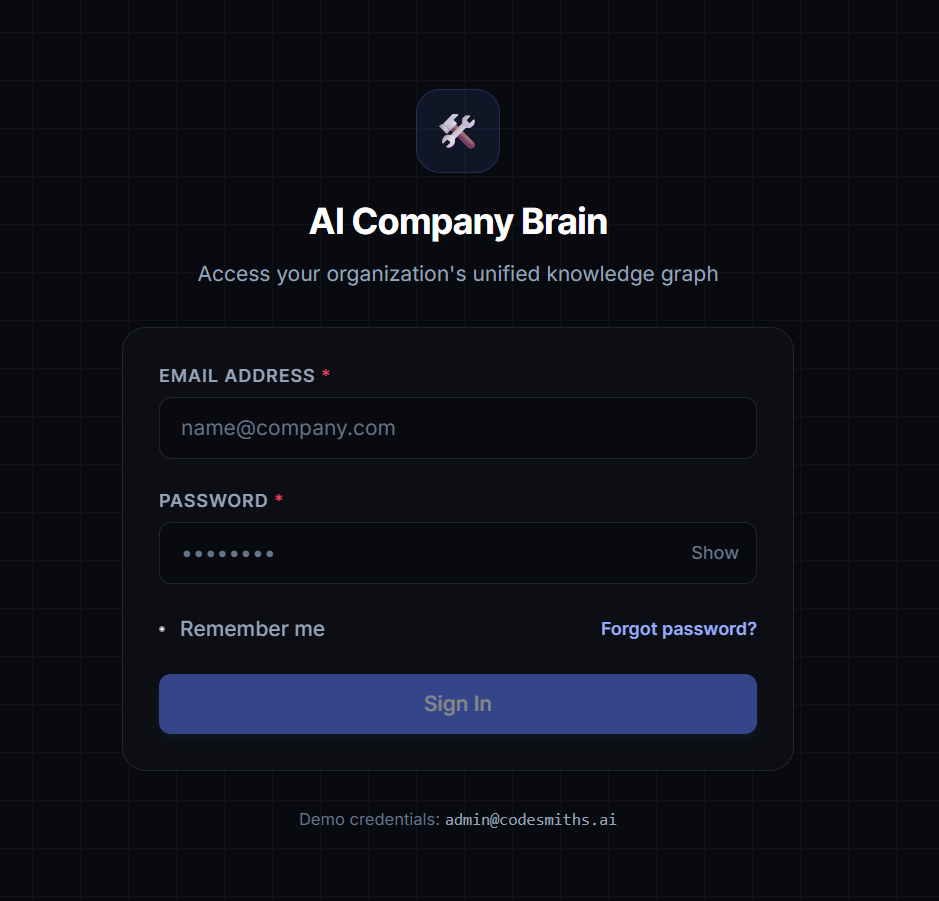
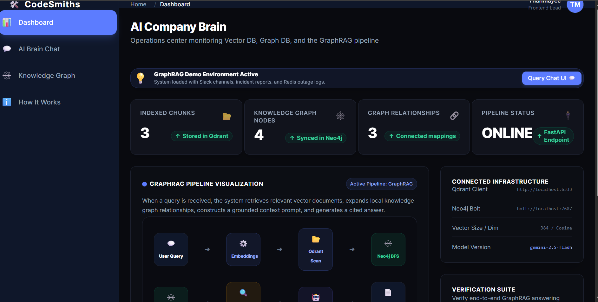
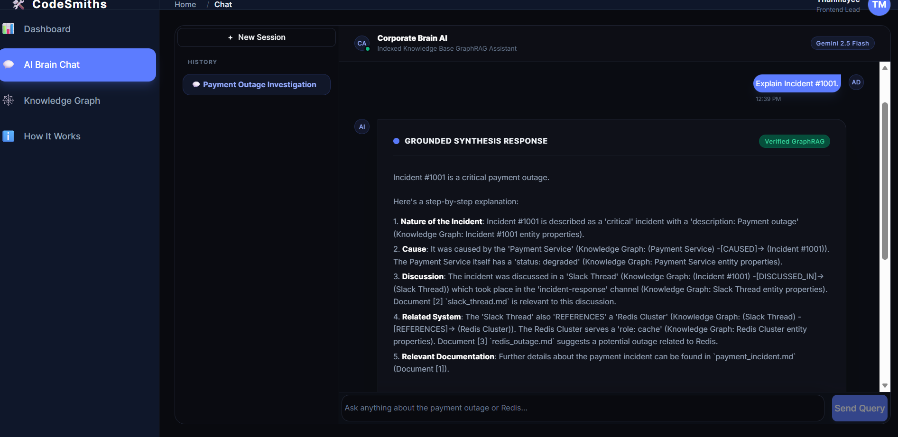
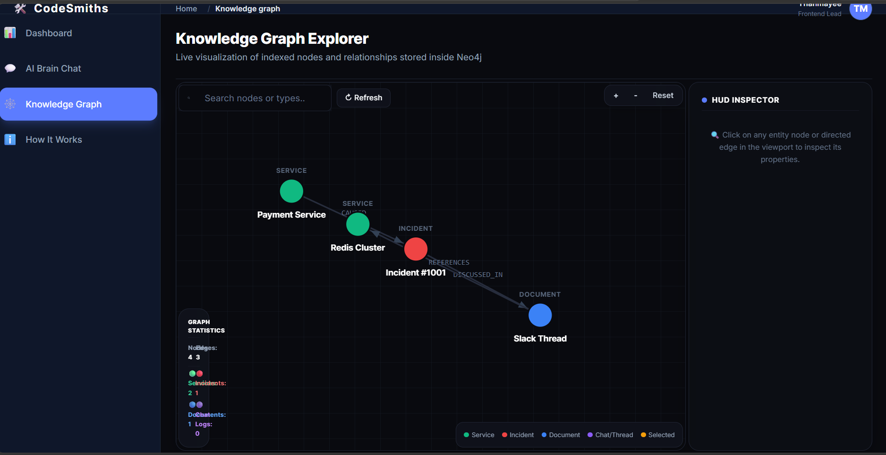

# 🧠 AI Company Brain

### An Enterprise GraphRAG Knowledge Platform for Explainable Organizational Intelligence

<p align="center">


</p>

---

# 📖 Overview

**AI Company Brain** is an enterprise-grade **GraphRAG (Graph Retrieval-Augmented Generation)** knowledge platform designed to transform fragmented organizational information into an intelligent, explainable, and queryable knowledge system.

Traditional enterprise search systems fail because they treat documents as isolated pieces of information. AI Company Brain goes beyond keyword search by combining:

* **Semantic vector retrieval**
* **Knowledge graph reasoning**
* **Large language models**
* **Source citations**
* **Explainable AI workflows**

The result is a system capable of answering complex organizational questions while providing transparent reasoning paths and verifiable sources.

---

# 🚨 The Problem

Modern organizations store information across dozens of disconnected systems:

* Slack conversations
* Internal documentation
* PDFs
* Incident reports
* Notion pages
* GitHub repositories
* Knowledge bases
* Engineering runbooks

Existing solutions suffer from several limitations:

| Problem                   | Existing Systems |
| ------------------------- | ---------------- |
| Keyword-based search      | ❌                |
| No semantic understanding | ❌                |
| No relationship reasoning | ❌                |
| Hallucinated answers      | ❌                |
| No source attribution     | ❌                |
| No explainability         | ❌                |

This creates a significant knowledge retrieval bottleneck where employees spend more time searching for information than using it.

---

# 💡 Our Solution

AI Company Brain combines:

```
Semantic Search
        +
Knowledge Graphs
        +
Graph Traversal
        +
LLM Reasoning
        +
Citation Generation
```

to create an explainable enterprise intelligence system.

Example query:

> "What caused the payment outage?"

Instead of returning documents, the system:

```
Question
    ↓
Embedding Generation
    ↓
Semantic Search
    ↓
Graph Expansion
    ↓
Knowledge Retrieval
    ↓
LLM Reasoning
    ↓
Source Attribution
    ↓
Final Answer
```

Result:

* Answer
* Reasoning steps
* Supporting entities
* Supporting documents
* Knowledge graph paths
* Source citations

---

# 🏗️ System Architecture

```
                    ┌──────────────────┐
                    │ React Frontend   │
                    └────────┬─────────┘
                             │
                             ▼
                    ┌──────────────────┐
                    │ FastAPI Backend  │
                    └────────┬─────────┘
                             │
         ┌───────────────────┼───────────────────┐
         ▼                   ▼                   ▼

 ┌──────────────┐    ┌──────────────┐    ┌──────────────┐
 │ Embeddings   │    │ Qdrant       │    │ Neo4j        │
 │ Generation   │───▶│ Vector DB    │    │ Knowledge DB │
 └──────────────┘    └──────────────┘    └──────────────┘
                             │                   │
                             ▼                   ▼
                      ┌───────────────────────────┐
                      │ Graph Expansion Engine    │
                      └─────────────┬─────────────┘
                                    ▼
                      ┌───────────────────────────┐
                      │ Gemini 2.5 Flash          │
                      │ Reasoning Engine          │
                      └─────────────┬─────────────┘
                                    ▼
                      ┌───────────────────────────┐
                      │ Citation Engine           │
                      └───────────────────────────┘
```

---

# 🚀 Features

## 🔍 Semantic Search

* Sentence-transformer embeddings
* Dense vector retrieval
* Similarity search
* Context-aware retrieval
* Semantic ranking

---

## 🕸️ Knowledge Graph

* Entity extraction
* Relationship mapping
* Multi-hop graph traversal
* Explainable graph reasoning
* Interactive graph visualization

---

## 🧠 GraphRAG

* Semantic retrieval
* Graph expansion
* Knowledge enrichment
* Multi-source reasoning
* Structured context generation

---

## 🤖 LLM Reasoning

* Gemini 2.5 Flash integration
* Context-aware synthesis
* Multi-document reasoning
* Graph-assisted generation

---

## 📑 Citation Engine

Every generated answer includes:

* Source documents
* Supporting entities
* Supporting relationships
* Evidence tracing
* Provenance mapping

---

## 📊 Enterprise Dashboard

* Knowledge statistics
* Database health
* Retrieval analytics
* Graph metrics
* System monitoring

---

## 🎨 Interactive Frontend

* Real-time chat
* Knowledge graph explorer
* Architecture visualization
* Source inspection
* Responsive UI

---

# 🧩 Tech Stack

## Frontend

| Technology   | Purpose        |
| ------------ | -------------- |
| React        | User Interface |
| Vite         | Build Tool     |
| Tailwind CSS | Styling        |
| JavaScript   | Frontend Logic |

---

## Backend

| Technology | Purpose       |
| ---------- | ------------- |
| Python     | Core Language |
| FastAPI    | API Framework |
| Pydantic   | Validation    |
| Uvicorn    | ASGI Server   |

---

## AI & ML

| Technology            | Purpose                |
| --------------------- | ---------------------- |
| Sentence Transformers | Embeddings             |
| all-MiniLM-L6-v2      | Embedding Model        |
| Gemini 2.5 Flash      | LLM Reasoning          |
| GraphRAG              | Retrieval Architecture |

---

## Databases

| Technology | Purpose         |
| ---------- | --------------- |
| Qdrant     | Vector Database |
| Neo4j      | Graph Database  |

---

## Infrastructure

| Technology     | Purpose             |
| -------------- | ------------------- |
| Docker         | Containerization    |
| Docker Desktop | Local Runtime       |
| WSL2           | Linux Compatibility |

---

# ⭐ What Makes This Different?

## Traditional RAG

```
Question
    ↓
Vector Search
    ↓
LLM
    ↓
Answer
```

Problems:

* Limited context
* Weak reasoning
* Hallucinations
* No relationships
* Poor explainability

---

## AI Company Brain

```
Question
     ↓
Embedding Search
     ↓
Vector Retrieval
     ↓
Knowledge Graph
     ↓
Graph Expansion
     ↓
LLM Reasoning
     ↓
Citation Engine
     ↓
Explainable Answer
```

Advantages:

✅ Semantic understanding

✅ Relationship reasoning

✅ Multi-hop retrieval

✅ Explainable outputs

✅ Source citations

✅ Knowledge graph exploration

---

# 📷 Demo Screenshots

## Login



---

## Dashboard



---

## AI Assistant



---

## Knowledge Graph



---

# 📂 Project Structure

```bash
CodeSmiths/

├── src/                     # React frontend
├── backend/
│   ├── app/
│   ├── embeddings/
│   ├── retrieval/
│   ├── graph/
│   ├── rag/
│   ├── citations/
│   ├── evaluation/
│   └── brain/
│
├── data/
├── agent_orchestration/
│
├── test_embeddings.py
├── test_qdrant.py
├── test_neo4j.py
├── test_graph_expansion.py
├── test_graph_rag.py
└── test_citations.py
```

---

# ⚙️ System Requirements

Minimum:

* Windows 10/11
* Linux
* macOS
* 8 GB RAM
* 15 GB free storage

Recommended:

* 16 GB RAM
* Quad-core CPU
* SSD
* Docker Desktop

---

# 🛠️ Prerequisites

Install:

* Python 3.12+
* Node.js 20+
* npm
* Git
* Docker Desktop
* WSL2 (Windows)

---

# 🐳 Start Databases

## Qdrant

```bash
docker run -d \
--name qdrant \
-p 6333:6333 \
-p 6334:6334 \
qdrant/qdrant
```

---

## Neo4j

```bash
docker run -d \
--name neo4j \
-p 7474:7474 \
-p 7687:7687 \
-e NEO4J_AUTH=neo4j/password123 \
neo4j
```

---

# 📥 Installation

Clone repository:

```bash
git clone https://github.com/YOUR_USERNAME/CodeSmiths.git

cd CodeSmiths
```

---

## Backend Setup

```bash
pip install -r requirements.txt
```

or

```bash
pip install \
fastapi \
uvicorn \
sentence-transformers \
qdrant-client \
neo4j \
google-generativeai
```

---

Create:

```bash
.env
```

Add:

```env
GEMINI_API_KEY=YOUR_GEMINI_API_KEY
```

---

## Frontend Setup

```bash
npm install
```

---

# 🚀 Running the Project

## Start Backend

```bash
python demo_server.py
```

Backend:

```
http://localhost:8000
```

API Docs:

```
http://localhost:8000/docs
```

---

## Start Frontend

```bash
npm run dev
```

Frontend:

```
http://localhost:5173
```

---

# 🧪 Testing

Run individual subsystem tests:

```bash
python test_qdrant.py
python test_neo4j.py
python test_graph_expansion.py
python test_graph_rag.py
python test_citations.py
```

---

# 📈 Example Query

Input:

> What caused the payment outage?

Output:

```
Answer:
The payment outage was caused by the Redis Cluster outage.

Sources:
[1] payment_incident.md
[2] redis_outage.md
[3] slack_thread.md

Graph Entities:
• Payment Service
• Incident #1001
• Slack Thread
• Redis Cluster
```

---

# 🔮 Future Improvements

* Multi-user authentication
* Role-based access control
* Real document connectors
* Slack integration
* Notion integration
* GitHub integration
* Hybrid retrieval
* Agentic workflows
* Real-time graph updates
* Fine-tuned retrieval models
* Observability dashboard
* Production deployment

---

# 👥 Team

Built by **Team CodeSmiths**.

Contributors:

* Backend Ingestion
* Frontend Dashboard
* Agent Orchestration
* AI Company Brain / GraphRAG

---

# 📜 License

This project is intended for educational, research, and demonstration purposes.

---

<p align="center">

### "From fragmented information to organizational intelligence."

</p>
