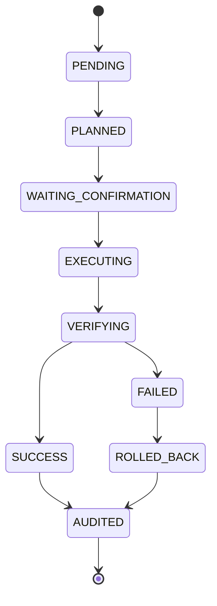

# Workflow State Machine

The Workflow State Machine coordinates state transitions across the execution lifecycle of the Enterprise AI Company Brain.

## Allowed States

- `PENDING`
- `PLANNED`
- `WAITING_CONFIRMATION`
- `EXECUTING`
- `VERIFYING`
- `SUCCESS`
- `FAILED`
- `ROLLED_BACK`
- `AUDITED`

## Transition Graph



## Usage

```python
from agent_orchestration.workflow.workflow_state_machine import WorkflowStateMachine
from agent_orchestration.workflow.workflow_models import WorkflowState

machine = WorkflowStateMachine()

# Transition state
machine.transition("wf-123", WorkflowState.PLANNED)
print(machine.current_state("wf-123")) # PLANNED
```
